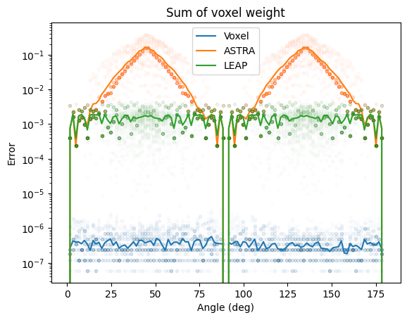

# VoxelProj

Exact trapezoid projection operators for parallel geometry.

## Motivation

As is often the case in numerical problems, CT projection operators usually force you to pick two out of three desirable properties from the set {general, fast, accurate}. Most libraries lean toward the first two.

By limiting this library to the latter two, we present projection operators that work in exactly one case: parallel projection with equal voxel-to-pixel dimensions.

With this heavy restriction, we achieve approximately the same speed as more general libraries, but with exact (to single precision) projection operators.

Here’s a comparison of voxel weights as a function of projection angle for all voxels in a 9×10 pixel grid. For comparison I present also the same for Tomosipo [^1] that uses ASTRA as a backend and LEAP [^2].



## Build Instructions

```
pip install .
```

## Example Use:

```python
import torch
import voxelproj
import numpy as np

# ARRAY SHAPES FOR THE TWO ORDERS
SX, SY, H = 512, 512, 512
n_angles = 192
order = 0
x_shape = {0: (SY, SX, H), 2: (H, SY, SX)}
y_shape = {0: (n_angles, PX, H), 2: (H, n_angles, PX)}

# SETUP DATA
angles = np.linspace(0, np.pi, n_angles).astype(np.float32)
x = torch.randn(x_shape[0], device="cuda")
y_inp = torch.zeros(y_shape[0], device="cuda")

# PROJECTION
# Any of these
y = voxelproj.forward(x, angles, y=None) #default output shape
y = voxelproj.forward(x, angles, y=y_shape[0]) #defined output shape
y_out = voxelproj.forward(x, angles, y=y_inp, z_order = order) #in-place
assert id(y_out) == id(y_inp)
```

## Benchmarks

These were taken on a RTX 3060 with pre-allocated torch tensors (no extra data transfer). n_angles=192 for all sizes.

| module      | function | 128 (mean ± std) | 256 (mean ± std) | 512 (mean ± std) |
| :---------- | :------- | :--------------- | :--------------- | :--------------- |
| Tomosipo    | A        | 5.6 ± 0.5        | 36.7 ± 0.6       | 300 ± 15         |
| Tomosipo    | AT       | 5.5 ± 0.7        | 34.3 ± 0.2       | 258.8 ± 0.8      |
| VoxelProj_0 | A        | 8.5 ± 0.5        | 59.8 ± 0.2       | 516 ± 3          |
| VoxelProj_0 | AT       | 7.7 ± 0.5        | 50.3 ± 0.4       | 397 ± 2          |
| VoxelProj_2 | A        | 11.2 ± 0.5       | 77.4 ± 0.4       | 610.5 ± 0.5      |
| VoxelProj_2 | AT       | 7.3 ± 0.4        | 50.3 ± 0.2       | 389.3 ± 0.6      |

Long story short, ASTRA is really fast.

### TODO

- Data chunking for larger datasets. (Currently, due to using shared memory for precomputed trigonometric parameters, n_angles is limited by MAX_ANGLES=512.)
- Translations: x-translation should have no computational overhead; y-translation could be handled via texture interpolation.

[^1]: [Tomosipo](https://github.com/ahendriksen/tomosipo)
[^2]: [LEAP](https://github.com/LLNL/leap)
