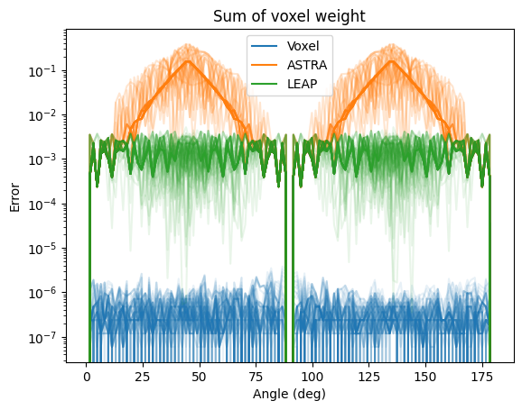

# VoxelProj

Exact trapezoid projection operators for parallel geometry.

## Motivation

As usual as for many problems, also CT projection operators are limited that you usually can only choose two of the desireable qualities in the set {general, fast , accurate}. The CT libraries online tends to lean towards the first two.

By limiting this library to the latter two, we present here projection operators that work in exactly one case: perellel projection with equal voxel tro pixel dimensions.

With this heavy limitation. We get approximately the same speed as more genral ones, but with exact (to single prtecision) operators.

Here is a comparison of voxel weights as a function of projection angle for all vozels in a 9\*10 pixel grid. For comparison I present also the same for Tomosipo [^1] that uses ASTRA as a backend and LEAP [^2].



## Build Instructions

```bash
pip install .
```

## Example Use:

```python
import torch
import voxelproj
import numpy as np

# ARRAY SHAPES FOR THE 2 ORDERS
x_shape = {0: (SY, SX, H), 2: (H, SY, SX)}
y_shape = {0: (n_angles, PX, H), 2: (H, n_angles, PX)}

# SETUP DATA
SX, SY, H = 512, 512, 512
n_angles = 192
angles = np.linspace(0, np.pi, n_angles).astype(np.float32)
x = torch.randn(x_shape[0], device="cuda")
y_inp = torch.zeros(y_shape[0], device="cuda")

# PREJECTION
# Any of these
y = voxelproj.forward(x, angles, y=None) #default output shape
y = voxelproj.forward(x, angles, y=y_shape[0]) #defined output shape
y_out = voxelproj.forward(x, angles, y=y_inp) #inplace
assert id(y_out) == id(y_inp)
```

## Benchmarks

These were taken on a RTX 3060 with pre-allocated torch tensors (no extra data transfer). n_angles=192 for all sizes.

| module      | function | 128 (mean ± std) | 256 (mean ± std) | 512 (mean ± std) |
| :---------- | :------- | :--------------- | :--------------- | :--------------- |
| Tomosipo    | A        | 5.6 ± 0.5        | 36.7 ± 0.6       | 300 ± 15         |
| Tomosipo    | AT       | 5.5 ± 0.7        | 34.3 ± 0.2       | 258.8 ± 0.8      |
| VoxelProj_0 | A        | 8.5 ± 0.5        | 59.8 ± 0.2       | 516 ± 3          |
| VoxelProj_0 | AT       | 7.7 ± 0.5        | 50.3 ± 0.4       | 397 ± 2          |
| VoxelProj_2 | A        | 11.2 ± 0.5       | 77.4 ± 0.4       | 610.5 ± 0.5      |
| VoxelProj_2 | AT       | 7.3 ± 0.4        | 50.3 ± 0.2       | 389.3 ± 0.6      |

Long story short, ASTRA is really fast.

### TODO

- Data chunking for larger datasets
- Translations

## Tests

asdasd

[^1]: [Tomosipo](https://github.com/ahendriksen/tomosipo)
[^2]: [LEAP](https://github.com/LLNL/leap)
